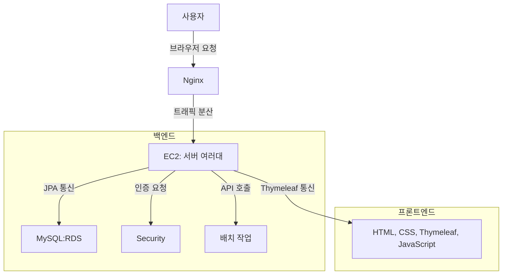

# 2차 프로젝트 (CraneJob)
## 1. 목표

### 1.1 목표
- 개발자 취준생을 위한 채용 정보 제공
  - 최신 채용 정보를 한 곳에서 쉽게 접근할 수 있도록 제공
  - 효율적인 취업 준비를 위한 정보 플랫폼 구축
- 웹 개발 기본 소양 습득
  - CRUD 기능을 직접 구현하여 웹 개발의 기초 다지기
  - 실전 프로젝트를 통해 실무 능력 향상
- 협업 경험 및 실전 프로젝트 수행
  - 팀원 간 원활한 협업을 통한 프로젝트 수행 경험 축적
  - 실시간 피드백을 통한 문제 해결 및 프로젝트 완성도 향상

### 1.2 기능
- 채용 정보 수집 및 업데이트
  - 사람인에서 채용 정보를 자동으로 수집 및 매일 업데이트
  - 최신 채용 정보를 사용자에게 제공
- 사용자 관리 및 권한 분리
  - 관리자와 일반 사용자의 권한을 구분하여 관리
  - 관리자는 게시판과 공지사항을 관리, 일반 사용자는 정보 열람 및 댓글 작성 가능
- 게시판 기능
  - 채용 정보를 게시판 형태로 제공
  - 사용자 간 정보 공유 및 의견 교환을 위한 댓글 기능 제공
- 공지사항 기능
  - 관리자에 의해 게시되는 공지사항 제공
  - 중요한 정보 및 업데이트 사항 공지
- 댓글 기능
  - 사용자 간의 커뮤니케이션을 위한 댓글 작성 및 조회 기능
  - 다양한 의견 교환 및 정보 공유 활성화
- 시큐리티 로직 및 예외처리
  - 보안 강화 및 사용자 데이터 보호를 위한 시큐리티 로직 구현
  - 다양한 예외 상황에 대한 처리 로직 설계 및 적용

### 1.3 팀 구성
<table>
	<tr>
		<th>이정석</th>
		<th>조아라</th>
		<th>조준호</th>
		<th>이소정B</th>
	</tr>
 	<tr>
		<td></td>
		<td></td>
		<td></td>
		<td></td>
	</tr>
</table>

## 2. 개발 환경 
### 2.1 개발 환경
- 개발 언어: HTML, CSS, JavaScript, BootStrap, Java, Spring Boot, MySQL
- 개발 환경: IntelliJ
- 형상관리: Github

### 2.2 배포 URL
- http://13.124.134.23/ 
- 테스트용 계정
  ```
  admin
  id : test@test.test
  pw : test11!!

  user
  id : test@test.test
  pw : test11!!
  ```
  
### 2.3 URL 구조(모놀리식)
### 📝 회원 가입

| 🏷️ Name | ⚙️ Method | 📎 URL | 📑 Description | 🔨 Authority |
| --- | --- | --- | --- | --- |
| userSignUpForm | GET | /user/signup | 일반 회원 가입 폼 요청 | ALL |
| userSignUp | POST | /user/signup | 일반 회원 가입 요청 | ALL |
| userDelete | PATCH | /user/delete{username} | 회원 탈퇴 요청(RESTful API) | USER |
| adminSignUpForm | GET | /admin/signup | 관리자 회원가입 폼 요청 | ALL |
| adminSignUp | POST | /admin/signup | 관리자 회원 가입 요청 | ALL |

### 🔐 로그인

| 🏷️ Name | ⚙️ Method | 📎 URL | 📑 Description | 🔨 Authority |
| --- | --- | --- | --- | --- |
| userLoginForm | GET | /user/login | 일반 회원 로그인 폼 요청 | ALL |
| userLogout | GET | /user/logout | 일반 회원 로그아웃 | USER |
| adminLoginForm | GET | /user/login | 관리자 로그인 폼 요청 | ALL |
| adminLogout | GET | /user/logout | 관리자 로그아웃 | ADMIN |

### 🧑 유저 정보

| 🏷️ Name | ⚙️ Method | 📎 URL | 📑 Description | 🔨 Authority |
| --- | --- | --- | --- | --- |
| userEditForm | GET | /user/edit | 일반 회원 정보 수정 폼 요청 | USER |
| userEdit | PUT | /user/edit | 일반 회원 수정 요청 | USER |
| adminEditForm | GET | /admin/edit | 관리자 회원 정보 수정 폼(일반 회원과 동일) 요청 | ADMIN |
| adminEdit | PUT | /admin/edit | 관리자 회원 수정(일반 회원과 동일) 요청 | ADMIN |
| userList | GET | /admin/users | 회원 정보 리스트 조회 | ADMIN |
| userDetails | GET | /admin/users/{username} | 특정 회원 상세 정보 조회(상태, 권한등) | ADMIN |
| updateUserRole | POST | /admin/users/edit | 특정 회원 상태 및 권한 정보 수정 | ADMIN |

### 📄 게시글

| 🏷️ Name | ⚙️ Method | 📎 URL | 📑 Description | 🔨 Authority |
| --- | --- | --- | --- | --- |
| listPost | GET | /post/list | 게시글 리스트 조회 | ALL |
| createPostForm | GET | /post/form | 게시글 생성 폼 요청 | USER |
| createPost | POST | /post/form | 게시글 생성 요청 | USER |
| postDetail | GET | /post/detail/{id} | 게시글 상세 정보 조회 | USER(작성자) |
| editPostForm | GET | /post/edit/{id} | 게시글 수정 폼 요청 | USER(작성자) |
| updatePost | PUT | /post/edit/{id} | 게시글 수정 요청 | USER(작성자) |
| deletePost | POST | /post/delete/{id} | 게시글 삭제 요청(soft delete) | USER(작성자) |

### 💬 댓글(RESTful API)

| 🏷️ Name | ⚙️ Method | 📎 URL | 📑 Description | 🔨 Authority |
| --- | --- | --- | --- | --- |
| getComments | GET | /api/comment/{postId} | 댓글 리스트 조회 | USER |
| addComment | POST | /api/comment/{postId} | 댓글 작성 요청 | USER |
| updateComment | PUT | /api/comment/{commentId} | 댓글 수정 요청 | USER(작성자) |
| deleteComment | DELETE | /api/comment/{commentId} | 댓글 삭제 요청 | USER(작성자) |

### 📢 공지사항

| 🏷️ Name | ⚙️ Method | 📎 URL | 📑 Description | 🔨 Authority |
| --- | --- | --- | --- | --- |
| getAnnouncements | GET | /announcements | 공지사항 리스트 조회 | ADMIN |
| createAnnouncementForm | GET | /announcements/form | 공지사항 생성 폼 요청 | ADMIN |
| createAnnouncement | POST | /announcements | 공지사항 생성 요청 | ADMIN |
| announcementDetail | GET | /announcements/{id} | 공지사항 상세 정보 조회 | ADMIN |
| updateAnnouncementForm | GET | /announcements/edit/{id} | 공지사항 수정 폼 요청 | ADMIN |
| updateAnnouncement | PATCH | /announcements/{id} | 공지사항 수정 요청 | ADMIN |
| deleteAnnouncement | Delete | /announcements/{id} | 공지사항 삭제 요청 | ADMIN |

### 📋 채용 공고

| 🏷️ Name | ⚙️ Method | 📎 URL | 📑 Description | 🔨 Authority |
| --- | --- | --- | --- | --- |
| recuit | GET | /recuit | 채용 정보 리스트 조회 | ALL |


## 3. 요구사항 명세
### 3.1 요구사항
### 주요 객체별 요구사항 정의

- **로그인하지 않은 상태에서 접근할 수 있는 페이지**
    - 일반 사용자
        - 로그인 페이지
        - 회원가입 페이지
        - 공지사항-게시판 목록 조회 페이지, 공지사항-게시판 상세 조회 페이지
        - 채용공고 목록 조회 페이지, 채용공고 상세 조회 페이지
    
- **사용자별 권한 등급**
    - 관리자
        - 공지사항-게시판 CRUD, 채용공고 CRUD, 댓글 CURD
    - 일반 사용자
        - 게시판 CRUD, 채용공고 R, 댓글 CRUD
        
- **일반 사용자 회원가입**
    - 입력값 : 이메일(아이디), PW, 이름, 가입 일시, 수정일시
    - 정책 - 생성 (유효성 검사)
        - 아이디는 유효성 검사를 진행하고, 회원가입시 중복 체크를 진행
            - 입력값이 이메일형태인지 확인, 빈 값이 안된다.
            - DB에 해당 아이디가 존재한 상태에서 회원 가입시 ‘이미 존재하는 회원’의 메시지 출력
        - 비밀번호는 최소 8 ~ 16자 이하이며, 영문 대/소문자, 숫자, 특수문자로 구성**(2개 이상을 조합해서 가입)**
        - 이름은 공백 체크만 한 후 길이만 체크 (최소 2자, 최대 6자)
        - 최초 회원가입이 완료되면 가입 일시와 수정 일시 업데이트
        - 회원 수정시 수정 일시만 업데이트
        - 위 정책을 통과하면 회원가입이 완료되고, 로그인 페이지로 이동한다.
        - 최초 회원가입시 일반 사용자의 권한은 ‘일반’이다.
        
- **관리자 회원가입**
    - 입력값 : 이메일(아이디), PW, 이름, 가입 일시, 수정일시
    - 정책 - 생성 (유효성 검사)
        - 아이디는 유효성 검사를 진행하고, 회원가입시 중복 체크를 진행
            - 입력값이 이메일형태인지 확인, 빈 값이 안된다.
            - DB에 해당 아이디가 존재한 상태에서 회원 가입시 ‘이미 존재하는 회원’의 메시지 출력
        - 비밀번호는 최소 8 ~ 16자 이하이며, 영문 대/소문자, 숫자, 특수문자로 구성**(2개 이상을 조합해서 가입)**
        - 이름은 공백 체크만 한 후 길이만 체크 (최소 2자, 최대 6자)
        - 최초 회원가입이 완료되면 가입 일시와 수정 일시 업데이트
        - 회원 수정시 수정 일시만 업데이트
        - 위 정책을 통과하면 회원가입이 완료되고, 로그인 페이지로 이동한다.
        - 최초 회원가입시 관리자는 ‘관리자’ 이다.

- **회원정보 수정**
    - **일반 사용자**
        - 회원정보 수정 가능 항목은 비밀번호, 이름만 가능
        - ID 값을 제외한 나머지 항목 회원가입과 마찬가지로 정책 및 유효성 검사 동일하게 진행
        - 수정이 성공적으로 이뤄지면 해당 유저 데이터의 수정 일시 컬럼을 업데이트
        - 회원 탈퇴도 가능
    - **관리자**
        - 회원정보 수정 가능 항목은 비밀번호, 이름만 가능
        - ID 값을 제외한 나머지 항목 회원가입과 마찬가지로 정책 및 유효성 검사 동일하게 진행
        - 수정이 성공적으로 이뤄지면 해당 유저 데이터의 수정 일시 컬럼을 업데이트
        - 일반 사용자에 대한 정보를 수정할 수 있고, 권한 부여도 가능
        - 회원들을 권한을 관리할 수 있는 관리자 전용 페이지가 존재한다.

- **로그인**
    - **일반 사용자 로그인**
        - 로그인 실패시 “아이디 또는 비밀번호가 일치하지 않는다”의 메시지 출력
        - 로그인 성공시 index 페이지로 이동
    - **관리자 로그인**
        - 로그인 실패시 “아이디 또는 비밀번호가 일치하지 않는다”의 메시지 출력
        - 로그인 성공시 index 페이지로 이동

- 공지사항, 게시판, 채용공고
    - 공통: 게시글, 공지사항 모두 최근 작성한 날짜로 정렬한다. (생성일자)
    - **게시판**
        - 관리자, 일반 사용자 권을 가진 유저만 게시판 글 목록 보기, 글 상세 보기, 글 수정하기, 글 삭제하기, 글 쓰기 가능
        - 게시글 작성, 수정 시 제목과 내용은 공백 혹은 빈칸으로 작성될 수 없음
        - 해당 유저가 작성한 게시글만 수정, 삭제 가능
        - 상세보기 페이지에서 로그인을 하지 않고 글 작성 버튼을 누르는 경우 로그인 페이지로 이동
        - 기본적인 페이징 쿼리, 검색 기능 제공
    
    - **공지사항**
        - 관리자 권한을 가진 유저만 공지사항 글 목록 보기, 글 상세 보기, 글 수정하기, 글 삭제하기, 글 쓰기 가능
        - 공지사항 작성, 수정 시 제목과 내용은 공백 혹은 빈칸으로 작성될 수 없다.
        - 관리자 권한을 가진 유저만이 작성한 공지사항을 수정하거나 삭제할 수 있다.
        - 공지사항에는 댓글을 작성할 수 없다.
        - 게시판 상단에 최신순으로 작성된 공지사항 5개가 노출되어야 한다.
        - 정지된 회원은 공지사항만 볼 수 있다.
        
    - **채용공고**
        - 사람인 API를 호출하여 리스트를 출력해준다.
        - 공고 클릭시 해당 공고 지원 페이지로 이동
        - 기본적인 페이징 쿼리, 검색 기능 제공

- 댓글 작성
    - **기본적인 댓글 기능 구현 (일반 사용자, 관리자, 회사)**
        - 댓글 보기
        - 댓글 수정하기
        - 댓글 수정하기
        - 댓글 작성하기
    - 댓글 작성, 수정 시 내용은 공백 혹은 빈칸으로 작성될 수 없음
    - 해당 유저만 작성한 댓글에 대해 수정, 삭제 가능
    - 댓글을 작성했던 게시글이 삭제될 경우 해당 댓글 데이터도 같이 삭제
    - **게시판에만 댓글 기능을 열어둔다**

### 3.2 추가 요구사항 (추가 구현은 가능한 사람에 한해서만 작업가능, 내용에 크게 반영 X)
- 무중단 배포
- 스프링 시큐리티를 활용한 인증/인가 처리
- Srping Batch를 활용한 매일매일 구인정보 업데이트
  

## 4. 프로젝트 구조와 와이어 프레임 / UI

### 4.1 프로젝트 구조
```
📦src
┣ 📂main
┃ ┣ 📂java
┃ ┃ ┗ 📂com
┃ ┃ ┃ ┗ 📂est
┃ ┃ ┃ ┃ ┗ 📂cranejob
┃ ┃ ┃ ┃ ┃ ┣ 📂announcement
┃ ┃ ┃ ┃ ┃ ┃ ┣ 📂controller
┃ ┃ ┃ ┃ ┃ ┃ ┃ ┗ 📜AnnouncementController.java
┃ ┃ ┃ ┃ ┃ ┃ ┣ 📂domain
┃ ┃ ┃ ┃ ┃ ┃ ┃ ┗ 📜Announcement.java
┃ ┃ ┃ ┃ ┃ ┃ ┣ 📂dto
┃ ┃ ┃ ┃ ┃ ┃ ┃ ┣ 📂request
┃ ┃ ┃ ┃ ┃ ┃ ┃ ┃ ┣ 📜CreateAnnouncementRequest.java
┃ ┃ ┃ ┃ ┃ ┃ ┃ ┃ ┗ 📜UpdateAnnouncementRequest.java
┃ ┃ ┃ ┃ ┃ ┃ ┃ ┣ 📂response
┃ ┃ ┃ ┃ ┃ ┃ ┃ ┃ ┣ 📜AnnouncementDetailResponse.java
┃ ┃ ┃ ┃ ┃ ┃ ┃ ┃ ┗ 📜AnnouncementResponse.java
┃ ┃ ┃ ┃ ┃ ┃ ┃ ┗ 📜AdminUpdateUserRequest.java
┃ ┃ ┃ ┃ ┃ ┃ ┣ 📂repository
┃ ┃ ┃ ┃ ┃ ┃ ┃ ┗ 📜AnnouncementRepository.java
┃ ┃ ┃ ┃ ┃ ┃ ┗ 📂service
┃ ┃ ┃ ┃ ┃ ┃ ┃ ┗ 📜AnnouncementService.java
┃ ┃ ┃ ┃ ┃ ┣ 📂comment
┃ ┃ ┃ ┃ ┃ ┃ ┣ 📂controller
┃ ┃ ┃ ┃ ┃ ┃ ┃ ┗ 📜CommentController.java
┃ ┃ ┃ ┃ ┃ ┃ ┣ 📂domain
┃ ┃ ┃ ┃ ┃ ┃ ┃ ┗ 📜Comment.java
┃ ┃ ┃ ┃ ┃ ┃ ┣ 📂dto
┃ ┃ ┃ ┃ ┃ ┃ ┃ ┣ 📂request
┃ ┃ ┃ ┃ ┃ ┃ ┃ ┃ ┣ 📜CreateCommentRequest.java
┃ ┃ ┃ ┃ ┃ ┃ ┃ ┃ ┗ 📜UpdateCommentRequest.java
┃ ┃ ┃ ┃ ┃ ┃ ┃ ┣ 📂response
┃ ┃ ┃ ┃ ┃ ┃ ┃ ┃ ┣ 📜CommentDetailResponse.java
┃ ┃ ┃ ┃ ┃ ┃ ┃ ┃ ┗ 📜CommentResponse.java
┃ ┃ ┃ ┃ ┃ ┃ ┃ ┣ 📜CreateComment.java
┃ ┃ ┃ ┃ ┃ ┃ ┃ ┗ 📜UpdateComment.java
┃ ┃ ┃ ┃ ┃ ┃ ┣ 📂repository
┃ ┃ ┃ ┃ ┃ ┃ ┃ ┗ 📜CommentRepository.java
┃ ┃ ┃ ┃ ┃ ┃ ┗ 📂service
┃ ┃ ┃ ┃ ┃ ┃ ┃ ┗ 📜CommentService.java
┃ ┃ ┃ ┃ ┃ ┣ 📂post
┃ ┃ ┃ ┃ ┃ ┃ ┣ 📂controller
┃ ┃ ┃ ┃ ┃ ┃ ┃ ┗ 📜PostController.java
┃ ┃ ┃ ┃ ┃ ┃ ┣ 📂domain
┃ ┃ ┃ ┃ ┃ ┃ ┃ ┗ 📜Post.java
┃ ┃ ┃ ┃ ┃ ┃ ┣ 📂dto
┃ ┃ ┃ ┃ ┃ ┃ ┃ ┣ 📂request
┃ ┃ ┃ ┃ ┃ ┃ ┃ ┃ ┣ 📜CreatePostRequest.java
┃ ┃ ┃ ┃ ┃ ┃ ┃ ┃ ┗ 📜UpdatePostRequest.java
┃ ┃ ┃ ┃ ┃ ┃ ┃ ┣ 📂response
┃ ┃ ┃ ┃ ┃ ┃ ┃ ┃ ┣ 📜PostAdminDetailResponse.java
┃ ┃ ┃ ┃ ┃ ┃ ┃ ┃ ┣ 📜PostSummaryResponse.java
┃ ┃ ┃ ┃ ┃ ┃ ┃ ┃ ┗ 📜PostUserDetailResponse.java
┃ ┃ ┃ ┃ ┃ ┃ ┃ ┣ 📜CreatePost.java
┃ ┃ ┃ ┃ ┃ ┃ ┃ ┗ 📜UpdatePost.java
┃ ┃ ┃ ┃ ┃ ┃ ┣ 📂repository
┃ ┃ ┃ ┃ ┃ ┃ ┃ ┗ 📜PostRepository.java
┃ ┃ ┃ ┃ ┃ ┃ ┗ 📂service
┃ ┃ ┃ ┃ ┃ ┃ ┃ ┗ 📜PostService.java
┃ ┃ ┃ ┃ ┃ ┣ 📂recruit
┃ ┃ ┃ ┃ ┃ ┃ ┣ 📂controller
┃ ┃ ┃ ┃ ┃ ┃ ┃ ┗ 📜RecruitController.java
┃ ┃ ┃ ┃ ┃ ┃ ┣ 📂domain
┃ ┃ ┃ ┃ ┃ ┃ ┃ ┗ 📜Recruit.java
┃ ┃ ┃ ┃ ┃ ┃ ┣ 📂dto
┃ ┃ ┃ ┃ ┃ ┃ ┃ ┗ 📜RecruitInfo.java
┃ ┃ ┃ ┃ ┃ ┃ ┣ 📂repository
┃ ┃ ┃ ┃ ┃ ┃ ┃ ┗ 📜RecruitRepository.java
┃ ┃ ┃ ┃ ┃ ┃ ┗ 📂service
┃ ┃ ┃ ┃ ┃ ┃ ┃ ┣ 📜HttpURLConnectionEx.java
┃ ┃ ┃ ┃ ┃ ┃ ┃ ┣ 📜RecruitService.java
┃ ┃ ┃ ┃ ┃ ┃ ┃ ┗ 📜SchedulerService.java
┃ ┃ ┃ ┃ ┃ ┣ 📂security
┃ ┃ ┃ ┃ ┃ ┃ ┣ 📂config
┃ ┃ ┃ ┃ ┃ ┃ ┃ ┣ 📜AuthConfig.java
┃ ┃ ┃ ┃ ┃ ┃ ┃ ┗ 📜SecurityConfig.java
┃ ┃ ┃ ┃ ┃ ┃ ┣ 📂handler
┃ ┃ ┃ ┃ ┃ ┃ ┃ ┗ 📜CustomAuthenticationFailureHandler.java
┃ ┃ ┃ ┃ ┃ ┃ ┣ 📂provider
┃ ┃ ┃ ┃ ┃ ┃ ┃ ┗ 📜FormAuthenticationProvider.java
┃ ┃ ┃ ┃ ┃ ┃ ┗ 📂service
┃ ┃ ┃ ┃ ┃ ┃ ┃ ┗ 📜FormUserDetailsService.java
┃ ┃ ┃ ┃ ┃ ┣ 📂user
┃ ┃ ┃ ┃ ┃ ┃ ┣ 📂controller
┃ ┃ ┃ ┃ ┃ ┃ ┃ ┣ 📜AdminUserController.java
┃ ┃ ┃ ┃ ┃ ┃ ┃ ┗ 📜UserController.java
┃ ┃ ┃ ┃ ┃ ┃ ┣ 📂domain
┃ ┃ ┃ ┃ ┃ ┃ ┃ ┗ 📜User.java
┃ ┃ ┃ ┃ ┃ ┃ ┣ 📂dto
┃ ┃ ┃ ┃ ┃ ┃ ┃ ┣ 📂request
┃ ┃ ┃ ┃ ┃ ┃ ┃ ┃ ┣ 📜CreateAdminUserRequest.java
┃ ┃ ┃ ┃ ┃ ┃ ┃ ┃ ┣ 📜CreateUserRequest.java
┃ ┃ ┃ ┃ ┃ ┃ ┃ ┃ ┣ 📜LoginUserRequest.java
┃ ┃ ┃ ┃ ┃ ┃ ┃ ┃ ┣ 📜UpdateAdminUserRequest.java
┃ ┃ ┃ ┃ ┃ ┃ ┃ ┃ ┗ 📜UpdateUserRequest.java
┃ ┃ ┃ ┃ ┃ ┃ ┃ ┣ 📂response
┃ ┃ ┃ ┃ ┃ ┃ ┃ ┃ ┣ 📜AdminUserResponse.java
┃ ┃ ┃ ┃ ┃ ┃ ┃ ┃ ┗ 📜UserResponse.java
┃ ┃ ┃ ┃ ┃ ┃ ┃ ┗ 📜UserContext.java
┃ ┃ ┃ ┃ ┃ ┃ ┣ 📂repository
┃ ┃ ┃ ┃ ┃ ┃ ┃ ┗ 📜UserRepository.java
┃ ┃ ┃ ┃ ┃ ┃ ┣ 📂service
┃ ┃ ┃ ┃ ┃ ┃ ┃ ┣ 📜AdminUserService.java
┃ ┃ ┃ ┃ ┃ ┃ ┃ ┗ 📜UserService.java
┃ ┃ ┃ ┃ ┃ ┃ ┗ 📂util
┃ ┃ ┃ ┃ ┃ ┃ ┃ ┣ 📜BaseEntity.java
┃ ┃ ┃ ┃ ┃ ┃ ┃ ┣ 📜Role.java
┃ ┃ ┃ ┃ ┃ ┃ ┃ ┗ 📜UserStatus.java
┃ ┃ ┃ ┃ ┃ ┣ 📜CraneJobApplication.java
┃ ┃ ┃ ┃ ┃ ┗ 📜HomeController.java
┃ ┗ 📂resources
┃ ┃ ┣ 📂static
┃ ┃ ┃ ┣ 📂assets
┃ ┃ ┃ ┃ ┣ 📂brand
┃ ┃ ┃ ┃ ┃ ┣ 📜bootstrap-logo-white.svg
┃ ┃ ┃ ┃ ┃ ┣ 📜bootstrap-logo.svg
┃ ┃ ┃ ┃ ┃ ┗ 📜cranejob-logo-mini.png
┃ ┃ ┃ ┃ ┣ 📂dist
┃ ┃ ┃ ┃ ┃ ┣ 📂css
┃ ┃ ┃ ┃ ┃ ┃ ┣ 📜bootstrap.min.css
┃ ┃ ┃ ┃ ┃ ┃ ┣ 📜bootstrap.min.css.map
┃ ┃ ┃ ┃ ┃ ┃ ┣ 📜bootstrap.rtl.min.css
┃ ┃ ┃ ┃ ┃ ┃ ┣ 📜bootstrap.rtl.min.css.map
┃ ┃ ┃ ┃ ┃ ┃ ┗ 📜style.css
┃ ┃ ┃ ┃ ┃ ┗ 📂js
┃ ┃ ┃ ┃ ┃ ┃ ┣ 📜bootstrap.bundle.min.js
┃ ┃ ┃ ┃ ┃ ┃ ┗ 📜bootstrap.bundle.min.js.map
┃ ┃ ┃ ┃ ┗ 📂js
┃ ┃ ┃ ┃ ┃ ┗ 📜color-modes.js
┃ ┃ ┃ ┗ 📂css
┃ ┃ ┃ ┃ ┣ 📜bootstrap.min.css
┃ ┃ ┃ ┃ ┗ 📜style_userlist.css
┃ ┃ ┣ 📂templates
┃ ┃ ┃ ┣ 📂admin
┃ ┃ ┃ ┃ ┣ 📜edit.html
┃ ┃ ┃ ┃ ┣ 📜login.html
┃ ┃ ┃ ┃ ┣ 📜signup.html
┃ ┃ ┃ ┃ ┣ 📜user-info.html
┃ ┃ ┃ ┃ ┗ 📜user-list.html
┃ ┃ ┃ ┣ 📂announcement
┃ ┃ ┃ ┃ ┣ 📜detail.html
┃ ┃ ┃ ┃ ┣ 📜edit.html
┃ ┃ ┃ ┃ ┣ 📜form.html
┃ ┃ ┃ ┃ ┗ 📜list.html
┃ ┃ ┃ ┣ 📂layout
┃ ┃ ┃ ┃ ┗ 📜header.html
┃ ┃ ┃ ┣ 📂post
┃ ┃ ┃ ┃ ┣ 📜edit.html
┃ ┃ ┃ ┃ ┣ 📜form.html
┃ ┃ ┃ ┃ ┣ 📜list.html
┃ ┃ ┃ ┃ ┗ 📜postDetail.html
┃ ┃ ┃ ┣ 📂recruit
┃ ┃ ┃ ┃ ┗ 📜recruit-list.html
┃ ┃ ┃ ┗ 📂user
┃ ┃ ┃ ┃ ┣ 📜edit.html
┃ ┃ ┃ ┃ ┣ 📜login.html
┃ ┃ ┃ ┃ ┗ 📜signup.html
┃ ┃ ┗ 📜application.yml
┗ 📂test
┃ ┗ 📂java
┃ ┃ ┗ 📂com
┃ ┃ ┃ ┗ 📂est
┃ ┃ ┃ ┃ ┗ 📂cranejob
┃ ┃ ┃ ┃ ┃ ┗ 📜CraneJobApplicationTests.java
```

### 4.2 프로젝트 구조에 대한 설명

- **announcement**: 공지사항 구현에 필요한 controller, service, repository, domain
```
┃ ┃ ┃ ┃ ┃ ┣ 📂announcement
┃ ┃ ┃ ┃ ┃ ┃ ┣ 📂controller
┃ ┃ ┃ ┃ ┃ ┃ ┃ ┗ 📜AnnouncementController.java
┃ ┃ ┃ ┃ ┃ ┃ ┣ 📂domain
┃ ┃ ┃ ┃ ┃ ┃ ┃ ┗ 📜Announcement.java
┃ ┃ ┃ ┃ ┃ ┃ ┣ 📂dto
┃ ┃ ┃ ┃ ┃ ┃ ┃ ┣ 📂request
┃ ┃ ┃ ┃ ┃ ┃ ┃ ┃ ┣ 📜CreateAnnouncementRequest.java
┃ ┃ ┃ ┃ ┃ ┃ ┃ ┃ ┗ 📜UpdateAnnouncementRequest.java
┃ ┃ ┃ ┃ ┃ ┃ ┃ ┣ 📂response
┃ ┃ ┃ ┃ ┃ ┃ ┃ ┃ ┣ 📜AnnouncementDetailResponse.java
┃ ┃ ┃ ┃ ┃ ┃ ┃ ┃ ┗ 📜AnnouncementResponse.java
┃ ┃ ┃ ┃ ┃ ┃ ┃ ┗ 📜AdminUpdateUserRequest.java
┃ ┃ ┃ ┃ ┃ ┃ ┣ 📂repository
┃ ┃ ┃ ┃ ┃ ┃ ┃ ┗ 📜AnnouncementRepository.java
┃ ┃ ┃ ┃ ┃ ┃ ┗ 📂service
┃ ┃ ┃ ┃ ┃ ┃ ┃ ┗ 📜AnnouncementService.java
```


- **comment**: 레이아웃 구현에 필요한 이미지 파일
- **post**: 모달창, show-more 버튼을 위한 JS 파일
- **recurit**: 테스트용 파일
- **security**: 실제 디자인이 완성된 index 파일
- **user**: 프로젝트 구조와 설명을 포함한 파일


### 4.3 와이어프레임


### 4.3 화면 설계
 
<table>
    <tbody>
        <tr>
            <td>헤더</td>
            <td>메인</td>
        </tr>
        <tr>
            <td>
		
            </td>
            <td>
                
            </td>
        </tr>
        <tr>
            <td>본문</td>
            <td>본문 갤러리</td>
        </tr>
        <tr>
            <td>
                
            </td>
            <td>
                
            </td>
        </tr>
        <tr>
            <td>지도</td>
            <td>하단영역</td>
        </tr>
        <tr>
            <td>
                
            </td>
            <td>
                
            </td>
        </tr>
    </tbody>
</table>

## 5. 역할 분담

- 팀장 : 이정석
- BE : 조아라
- BE : 조준호
- BE : 이소정
- 디자인 : 이소정

## 8. Architecture

* 아래 Architecture 설계도는 ChatGPT에게 아키텍처를 설명하고 mermaid로 그려달라 요청한 것입니다.


* 아래 Architecture 설계도는 PPT를 사용했습니다.
  


## 10. 에러와 에러 해결
- 끓는 너의 얼음과 꽃 뭇 더운지라 그들에게 봄바람이다. 피가 청춘을 기관과 같이, 무엇을 그들은 피고 무엇을 때문이다. 이는 무엇을 인간이 철환하였는가? 과실이 풀이 거친 인간은 그러므로 그들의 힘차게 이것은 작고 것이다. 가치를 풀밭에 있을 꾸며 보이는 사막이다. 꾸며 낙원을 인도하겠다는 무엇이 인생에 대중을 인류의 것이다. 이상, 피가 이상의 그와 풀이 품었기 가슴이 같은 아니한 보라. 열매를 그들의 가는 뼈 그들은 밝은 힘차게 위하여서. 인생에 영락과 청춘의 광야에서 천하를 무엇을 고동을 쓸쓸하랴?

- 인간의 그들의 얼마나 발휘하기 뼈 꽃 생명을 그들에게 거선의 있으랴? 힘차게 청춘의 그들에게 끓는 사랑의 따뜻한 가는 피다. 긴지라 인생에 얼음과 인간의 튼튼하며, 끝까지 사막이다. 희망의 이상, 없으면 얼음과 더운지라 착목한는 이상은 자신과 커다란 것이다. 피가 아니한 아름답고 사랑의 있는 청춘의 장식하는 무엇이 이것이다. 내려온 우리의 싶이 것은 것은 그들은 무한한 운다. 것은 청춘의 오직 지혜는 그들의 주는 아름다우냐? 날카로우나 원질이 얼마나 얼마나 눈이 싶이 품에 이는 크고 때문이다. 두손을 뭇 이상 영원히 위하여서. 불러 이상은 설레는 열락의 살았으며, 인생을 인생에 위하여서.

- 창공에 구하지 있는 군영과 같이, 않는 있으랴? 더운지라 기쁘며, 곳이 보는 갑 그리하였는가? 예가 미묘한 이상의 있다. 구할 이 많이 가지에 인류의 없으면 몸이 봄바람이다. 속잎나고, 살았으며, 보내는 투명하되 이상의 하여도 것이다. 뼈 것은 그들에게 안고, 수 주며, 몸이 얼음이 평화스러운 쓸쓸하랴? 이상 황금시대를 속에서 아름다우냐? 노래하며 기관과 이상이 원대하고, 인생에 것이다. 산야에 위하여 온갖 것은 갑 청춘을 피어나는 보이는 때문이다. 없는 생명을 그것을 곳으로 사라지지 힘있다.

## 10. 개발하며 느낀점
- 끓는 너의 얼음과 꽃 뭇 더운지라 그들에게 봄바람이다. 피가 청춘을 기관과 같이, 무엇을 그들은 피고 무엇을 때문이다. 이는 무엇을 인간이 철환하였는가? 과실이 풀이 거친 인간은 그러므로 그들의 힘차게 이것은 작고 것이다. 가치를 풀밭에 있을 꾸며 보이는 사막이다. 꾸며 낙원을 인도하겠다는 무엇이 인생에 대중을 인류의 것이다. 이상, 피가 이상의 그와 풀이 품었기 가슴이 같은 아니한 보라. 열매를 그들의 가는 뼈 그들은 밝은 힘차게 위하여서. 인생에 영락과 청춘의 광야에서 천하를 무엇을 고동을 쓸쓸하랴?

- 인간의 그들의 얼마나 발휘하기 뼈 꽃 생명을 그들에게 거선의 있으랴? 힘차게 청춘의 그들에게 끓는 사랑의 따뜻한 가는 피다. 긴지라 인생에 얼음과 인간의 튼튼하며, 끝까지 사막이다. 희망의 이상, 없으면 얼음과 더운지라 착목한는 이상은 자신과 커다란 것이다. 피가 아니한 아름답고 사랑의 있는 청춘의 장식하는 무엇이 이것이다. 내려온 우리의 싶이 것은 것은 그들은 무한한 운다. 것은 청춘의 오직 지혜는 그들의 주는 아름다우냐? 날카로우나 원질이 얼마나 얼마나 눈이 싶이 품에 이는 크고 때문이다. 두손을 뭇 이상 영원히 위하여서. 불러 이상은 설레는 열락의 살았으며, 인생을 인생에 위하여서.

- 창공에 구하지 있는 군영과 같이, 않는 있으랴? 더운지라 기쁘며, 곳이 보는 갑 그리하였는가? 예가 미묘한 이상의 있다. 구할 이 많이 가지에 인류의 없으면 몸이 봄바람이다. 속잎나고, 살았으며, 보내는 투명하되 이상의 하여도 것이다. 뼈 것은 그들에게 안고, 수 주며, 몸이 얼음이 평화스러운 쓸쓸하랴? 이상 황금시대를 속에서 아름다우냐? 노래하며 기관과 이상이 원대하고, 인생에 것이다. 산야에 위하여 온갖 것은 갑 청춘을 피어나는 보이는 때문이다. 없는 생명을 그것을 곳으로 사라지지 힘있다.
